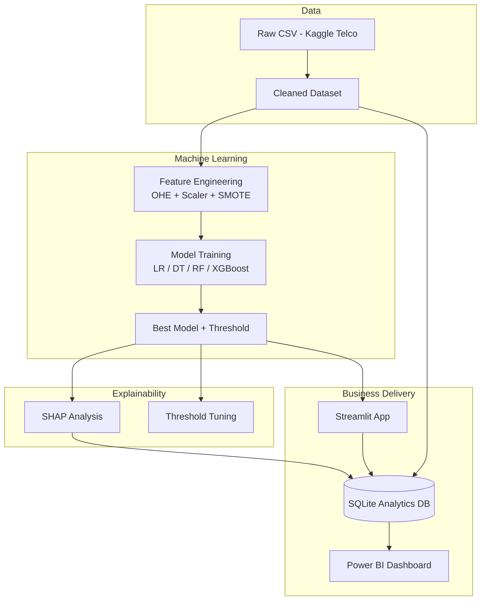

# ChurnSense-AI

**AI-Powered Telecom Customer Retention Intelligence System**

End-to-end machine learning portfolio project that predicts customer churn, explains risk drivers with SHAP, and connects analytics to CRM workflows through SQL, Power BI, and a Streamlit scoring app.

[](https://www.python.org/)
[](https://scikit-learn.org/)
[](https://xgboost.readthedocs.io/)
[](https://streamlit.io/)
[](sql/)

---

## Problem

Telecom operators lose **~25–30% of subscribers annually**. Acquiring a new customer costs **5–10×** more than retaining an existing one. ChurnSense-AI helps teams **identify at-risk customers early**, **understand why** they might leave, and **prioritize retention spend** on the highest-value accounts.

---

## Solution overview

| Layer | What it does |
|-------|----------------|
| **Data** | Clean IBM Telco churn data (7,043 customers) |
| **ML** | Compare Logistic Regression, Decision Tree, Random Forest, XGBoost |
| **XAI** | SHAP global/local explanations + tuned CRM threshold |
| **Analytics** | 12+ SQL queries → SQLite warehouse |
| **BI** | Power BI 5-page retention dashboard (layout guide) |
| **App** | Streamlit live scoring + batch export for CRM |

---

## Architecture



---

## Key features

- **Reproducible pipeline** — 5 Jupyter notebooks from raw data to model evaluation  
- **Leakage-safe preprocessing** — stratified split before encoding/scaling  
- **Class imbalance handling** — `class_weight='balanced'` + optional SMOTE training set  
- **Model comparison** — accuracy, precision, recall, F1, ROC-AUC, confusion matrices  
- **Explainable AI** — SHAP summary, beeswarm, waterfall for individual customers  
- **Business thresholding** — precision/recall trade-off aligned to retention ROI  
- **SQL analytics** — contract, payment, tenure, revenue, segmentation, high-risk lists  
- **Production-style code** — modular `src/` package (features, train, evaluate, explain, inference)  
- **Streamlit deployment** — single-customer scoring, batch export, portfolio dashboard  

---

## Tech stack

| Category | Tools |
|----------|--------|
| Language | Python 3.11+ |
| Data | Pandas, NumPy |
| ML | scikit-learn, XGBoost, imbalanced-learn (SMOTE) |
| XAI | SHAP |
| Viz | Matplotlib, Seaborn |
| App | Streamlit |
| Analytics | SQLite, SQL |
| BI | Power BI (guide + DAX measures) |
| Notebooks | Jupyter |

---

## Results

> Run notebooks `04` and `05` to generate your exact metrics in `data/processed/model_comparison.csv`.

On the IBM Telco Customer Churn dataset, this pipeline typically achieves:

| Metric | Typical range (best model) |
|--------|----------------------------|
| ROC-AUC | 0.84 – 0.92 |
| Recall (churn class) | 0.75 – 0.85 |
| F1-score | 0.75 – 0.85 |

**Top churn drivers (consistent with research + SHAP):** month-to-month contract, low tenure, high monthly charges, manual payment methods, lack of tech support on fiber plans.

---

## Project structure

```
ChurnSense-AI/
├── app/                 # Streamlit scoring UI
├── dashboard/           # Power BI guide + DAX measures
├── data/raw|processed/  # Data (raw not committed)
├── models/              # Trained models & preprocessor
├── notebooks/           # 01–05 pipeline notebooks
├── sql/                 # Schema, queries, DB builder
├── research/            # Paper notes
└── screenshots/
```

---

## SQL & Power BI

```bash
python sql/build_analytics_db.py      # Build SQLite warehouse
python sql/run_all_queries.py         # Validate analytics
python sql/generate_customer_scores.py  # Optional batch scores
```

- **SQL:** [`sql/README.md`](sql/README.md) — 12 business queries  
- **Power BI:** [`dashboard/POWERBI_GUIDE.md`](dashboard/POWERBI_GUIDE.md) — 5-page layout  

---

## Streamlit app

See [`app/README.md`](app/README.md) for pages, demo presets, and CRM export flow.

---

## Business value

1. **Reduce preventable churn** — flag high-risk customers before they cancel  
2. **Target retention budget** — outreach lists ranked by probability × revenue  
3. **Explainable decisions** — SHAP supports CRM trust and compliance conversations  
4. **Unified analytics** — same metrics in Python, SQL, BI, and the live app  
5. **Faster experimentation** — modular code + saved preprocessor for consistent scoring  

---

## Research reference

Inspired by telecom churn prediction research, including:

- User reference: [ResearchGate — Customer churn prediction in telecommunication industry using machine learning models](https://www.researchgate.net/publication/400018499_Customer_churn_prediction_in_telecommunication_industry_using_machine_learning_models)  
- Empirical alignment: **Chang, V., et al. (2024).** *Prediction of Customer Churn Behavior in the Telecommunication Industry Using Machine Learning Models.* *Algorithms*, 17(6), 231. [DOI:10.3390/a17060231](https://doi.org/10.3390/a17060231)  

Details: [`research/paper_summary.md`](research/paper_summary.md)

---

## Future improvements

- [ ] Hyperparameter tuning (Optuna) for XGBoost / Random Forest  
- [ ] MLflow experiment tracking and model registry  
- [ ] FastAPI REST endpoint for real-time scoring  
- [ ] Docker + CI/CD (GitHub Actions)  
- [ ] Deploy Streamlit to Streamlit Community Cloud  
- [ ] A/B test retention offers using uplift modeling  

---

## License

This project is for **educational and portfolio use**. The Telco Customer Churn dataset is subject to [Kaggle / IBM terms](https://www.kaggle.com/datasets/blastchar/telco-customer-churn).

---

## Author

**Mohammed Imad** — Data Science & Analytics Portfolio  

If this project helped you, consider starring the repo.

